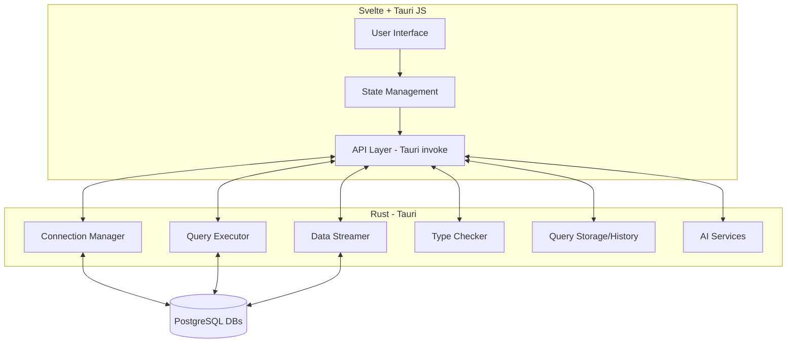

# Ristretto Architecture

## 1. High-Level Architecture



---

## 2. Use Cases

### 2.1. Connect to Multiple Databases

- User adds/edit/removes database connections.
- Connections are managed in Rust (secure, persistent).
- UI lists and manages active connections.

### 2.2. Run SQL Queries

- User writes SQL in the editor.
- Query sent to Rust backend for execution.
- Results streamed (not fully loaded) to JS for large datasets.

### 2.3. Autoformat, Save, and History

- SQL queries can be autoformatted (client-side or backend).
- Queries can be saved and organized.
- Query history is stored and searchable.

### 2.4. Autocompletion & Types

- On connection, fetch schema (tables, columns, types).
- Provide autocompletion in the editor.
- Type information checked before rendering/storing results.

### 2.5. AI Features

- Natural language to SQL, SQL explanation, and optimization via AI service (local or remote).

---

## 3. Project Structure Proposal

```text
/src
    /routes         # SvelteKit routes (UI pages)
    /lib            # Shared Svelte components, stores, utils
    /api            # JS API layer for Tauri invokes
/src-tauri
    /src
        main.rs         # Tauri entrypoint
        lib.rs          # Rust logic
        /db
            mod.rs          # Database connection/manager
            connection.rs   # Connection pool, multiple DBs
            query.rs        # Query execution, streaming
            types.rs        # Type checking, schema
        /ai
            mod.rs          # AI features
        /storage
            mod.rs          # Query history, saved queries
/tests
    # Integration and unit tests
```

---

## 4. Key Design Decisions

### Multiple Connections

- Use a connection pool in Rust (e.g., sqlx or tokio-postgres).
- Each connection has a unique ID; managed in a HashMap.
- Frontend can switch between connections.

### Data Streaming

- For large result sets, stream rows from Rust to JS in chunks.
- Use Tauri's event system or chunked invoke responses.

### Type Handling

- On query, fetch column types.
- Type check before rendering in UI.
- Store type info with query results/history.

---

## 5. Example Use Case Diagram

```mermaid
usecase
  actor User
  User --> (Connect to Database)
  User --> (Run SQL Query)
  User --> (View Query Results)
  User --> (Save Query)
  User --> (View Query History)
  User --> (Use AI Features)
  (Run SQL Query) --> (Stream Results)
  (Run SQL Query) --> (Type Check Results)
```

---

## 6. Next Steps

- Finalize the folder structure and create stubs for each module.
- Define Rust interfaces for connection management, query execution, and streaming.
- Set up Svelte stores and API layer for invoking Tauri commands.
- Document the data flow and error handling strategy.
